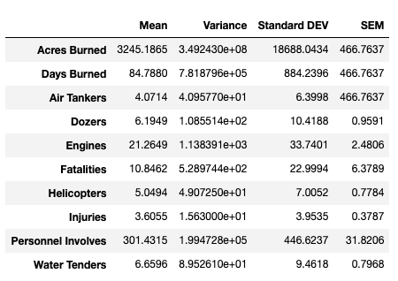
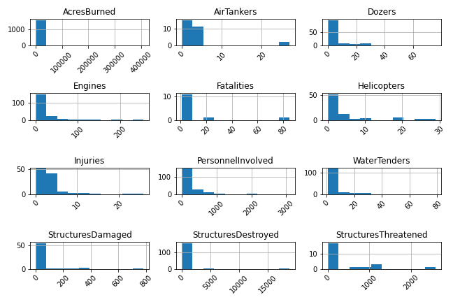

# Pyres of California

## Background

Our project is to evaluate and analyze California Wildfire Data based on a California Wildfire Incidents dataset between 2013 and 2019. The project will focus on factors such as resources deployed, acreage burned, structure damage, injuries, personnel involved in firefighting and related questions, as the data admits.

## Assumption

- [California wildfire incidents from 2013 to 2019]('Resources/California_Fire_Incidents_original.csv') and [list of California county]('Resources/ca_county_list.csv') will be applied in order to conduct the analysis.
- The analysis will be divided into 2 main parts, all fire incidents and major fire incidents (based on dataset).
- In each main part, the analysis will focus on resources and the damage of fire by County. 
- Personnel invloved will represent all the resources in this analysis.

## Hypothesis

- Fire incident has a time pattern of occurrence
- Burned time has relation with burned area.
- Larger area of burn or longer fire duration requires more resources
- Higher number of fire incidents lead to higher number of injuries

## Data Limitation

- Data incompletion which will be excluded might cause an inaccurate conclusion.
- The definition of major fire incident in the dataset which indicates by true/false differs from California Fire Department which states that major fire incident is more than 10 arces. The group decision was using the information based on the dataset because we counldn't find the evidence to support if the file is uncredible.

## Analysis

### Statistical Summary

Overall statistics performed for the overall data set were calculated for various critical parameters, including acres burned, injuries, equipment used, personnel involved, and structures damaged and destroyed, etc. As presented in the table, there is a wide range of values for each parameter, as reflected by the differential variance and standard deviation. Also, the histogram graph shows that the dataset is a random distribution.

**Statistical Table** | **Histogram Graph**
--------------------- | ---------------------
 | 
